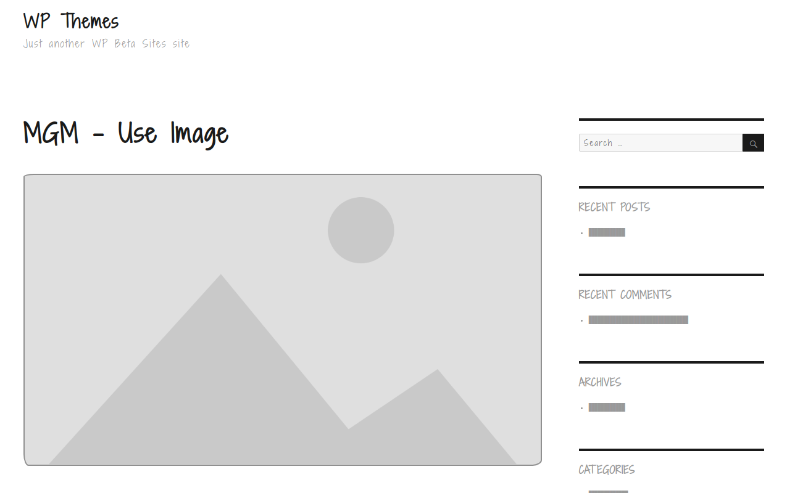

# Wireframe CSS

Gives your WordPress theme a wireframy look. Meant for pre-design prototyping. 



## Description
When setting up a new website the first thing I discuss with my client is the structure of the site.
Many people have a hard time wrapping their head around an abstract subject like the structure of their site. 
I tried different ways to communicate website structure (text-documents, sketching, wireframing tool X and prototyping tool Y). 
But it turned out that both approaches are rather time-consuming and not very intuitive. 
People are struggling to understand what those documents really mean for their website.

I am working with my own standard theme and, I do layout and design directly in the browser. So I wondered if I could do the whole structure thing in the browser, too.
So I made up some CSS that removes "designy" elements from the WordPress theme. It also takes away the images and shows some dull placeholder image instead.
I feel that this helps to focus on the elements themselves and how everything works together.
This way the website looks somehow defamiliarised, but it feels like a normal website. You can click and scroll as usual.  
This approach is working rather well for me and my clients. 

I think the best fit will be for rather simple websites where basically the designer communicates with the client one-to-one. 
For larger projects with complex templating, prototyping tools may be the better choice.


## Notes
This is a very simple plugin. It doesn't write to the database and has no options.
It just adds some CSS to the <head> section. Deactivate the plugin, and the styles will be gone.

I use a special webfont called `redacted` created by Christian Naths which changes the copy text to abstract gray bars.
https://github.com/christiannaths/Redacted-Font
Thank you, Christian!


## Frequently Asked Questions

### I can't see a wireframe look with my theme.

The wireframe css works together with all the latest standard themes: Twentysixteen, Twentyseventeen, Twentynineteen and TwentyTwenty.

The plugin works for many other themes, too. Because the HTML structure varies.
In many cases you need to make some adaptions to the wireframe.css. 

There are two places in the css file where you can add extra selectors or classes. 
Look for these comments:
```css
  /* 1. Text elements that will be not readable (gray bars)
  like paragraphs for example. */

  /* 2. Text elements with sketch font that will still be readable
  Like headlines and links for example. */
```

In your theme look for selectors and classes that add a font-family. 
Add these selectors and/or classes to the wireframe.css.

For example:
```css
  /** 1. Elements with redacted font (gray bars – not readable). */
  p,
  .widget *,
  .my-class {
  font-family: "redactedregular" !important;
  }
```
